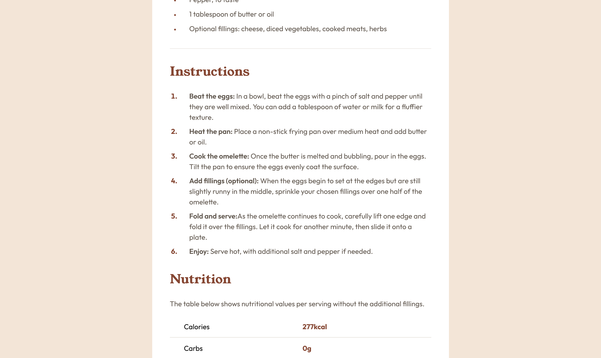

# Frontend Mentor - Recipe Page solution

This is a solution to the [Recipe page challenge on Frontend Mentor](https://www.frontendmentor.io/challenges/recipe-page-KiTsR8QQKm). Frontend Mentor challenges help you improve your coding skills by building realistic projects. 

## Table of contents

- [Overview](#overview)
  - [The challenge](#the-challenge)
  - [Screenshot](#screenshot)
  - [Links](#links)
- [My process](#my-process)
  - [Built with](#built-with)
- [Author](#author)

## Overview

I've decided to study the fullstack roadmap from the bottom up. For this challenge, I'm focusing solely on SASS (SCSS). My main goals were the fundamentals of SASS while using nesting, mixins and variables. I adopted a component-based workflow by default, even though the challenge was straight forward.

This challenge was a great opportunity to apply what I've been learning. Next stop is Vanilla JavaScript!

### The challenge

Users should be able to:

- View a complete recipe page featuring a table, ordered and unordered lists, and a description

### Screenshot

### Links

- Live Site URL: [Github Pages](https://ropierre.github.io/frontend-mentor_Recipe-page/)
- Solution URL: [Github](https://github.com/ROPierre/frontend-mentor_Recipe-page)

## My process

### Learnings

- How to structure SCSS using nesting and mixins effectively, and how to maintain modularity with a component-based approach.
- Use of partials to keep my code clean

### Built with

- Semantic HTML5 markup
- Sass (SCSS)
- Component workflow

### Continued development

Next, I plan to study Vanilla JavaScript and continue using SCSS in upcoming challenges to reinforce my skills.

## Author

- GitHub - [Rafael Pierre](https://github.com/ROPierre)
- Frontend Mentor - [@ROPierre](https://www.frontendmentor.io/profile/ROPierre)